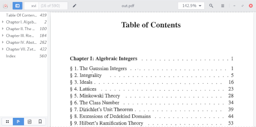
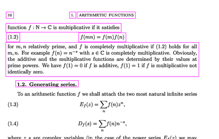
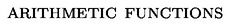

# ebooktoc


The goal of this tool is to make digital books easier to browse by automatically adding missing outlines and synchronizing virtual/actual page numbers:



At the moment, the tool runs on PDF files (but djvu support is on the way).

## Command line usage

```bash
Usage:
  ebooktoc auto [options] <filename> [<output>]
  ebooktoc toc [options] <filename> <toc.txt> [<output>]
  ebooktoc pages [options] <filename> <pages.txt> [<output>]

Options:
  --interactive       Ask users to check for OCR errors (in auto mode)
  --no-toc            Disable table of contents generation (in auto mode)
  --no-repagination   Disable repagination (in auto mode)
  --no-cache          Disable caching (in auto mode)
  --debug             Show debugging information
```

If `<output>` is not specified, an attempt will be made to retrieve the book's metadata (from its ISBN) and base the filename on it. If this fails, the output filename will be the original filename suffixed by -out.
### Modes
- **auto**:  The table of contents and page remapping are automatically generated by running OCR on the whole document.
- **toc**:   Replace the table of contents of the document by that provided in the file toc.txt.
          Every line of the latter should be of the form `level page Title`, see examples/toc.txt.
- **pages**: Replace the correspondence actual/display pages in the document by that provided in the file pages.txt.
          Every line of the latter should be of the form `actual page: page number to display`, e.g. `10: 5`.  The page numbers are automatically interpolated.

## Installation

Install Imagemagick, tesseract, libtesseract, libleptonica and run `python setup.py install`

## To do 

- Finish the djvu implementation.
- Test the table of content extraction from that of the document.
- Implement automatic detection of the table of contents.

## How it works

There are several steps:

### 1.  Detect text blocks on the upper and lower parts of every page


This is done by classical computer vision algorithm through OpenCV: threshold the image, dilate it, and find contours. See in `processor/detectTextBlocks.py` and `processor/page.py`.

### 2. Perform OCR 


This is done using tesseract. Depending on the content and the position, a block may be classified as a potential page number or heading. See in `processor/ocr.py`

### 3. Detect and scan table of contents

Find the pages containing the table of contents, and perform OCR on it to extract couples `(start page, label, level)`.

### 4. Correct anomalies

The previous steps give a list of potential page numbers and heading for every page. We can cleanup anomalies such as unexpected jumps in page numbers or meaningless headings. See in `processor/document.py`

### 5. Integrate outline and page mapping to the document

See in `document/`.
